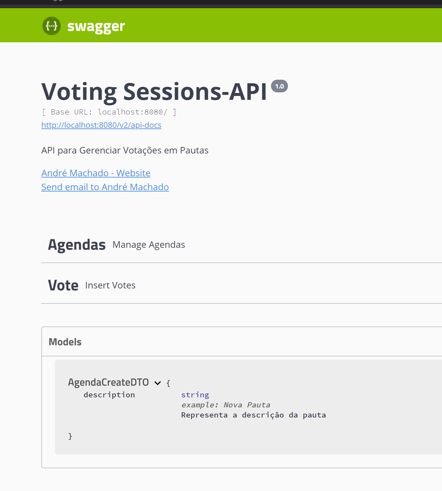

# Voting-API

API para gerenciamento de votações em pautas com as seguintes funcionalidades: criar pauta, 
criar sessão, abrir sessão, votar em pautas e contabilizar os votos.

### 📋 Pré-requisitos

JDK 11+, Docker e uma IDE de sua preferência.

## 🚀 Começando

Realize o clone do projeto, abra o projeto em uma IDE de sua preferência, realize 
o download das dependências. Após as configrações iniciais, com o docker instalado realize o seguinte comando:

docker run --name votingSessionDB -p 3306:3306/tcp -e MYSQL_ROOT_PASSWORD=123 -d mysql

Este comando iniciará um container docker com o servidor mysql, ao iniciar a aplicação o banco de dados e as tabelas 
serão criadas pelo Spring Boot

## 🛠️ Construído com

Java 11, Spring Boot, Bean Validation para validações de objetos, Java Persistence API (JPA) para persistêcia de 
dados, banco de dados Mysql, Swagger 2 para documentação e realização de requisições a API.

## ⚙️ Executando os END-POINTS

Acesse o link: http://localhost:8080/swagger-ui.html e obtenha o SWAGGER para ler a documentação e executar os end-points

    

